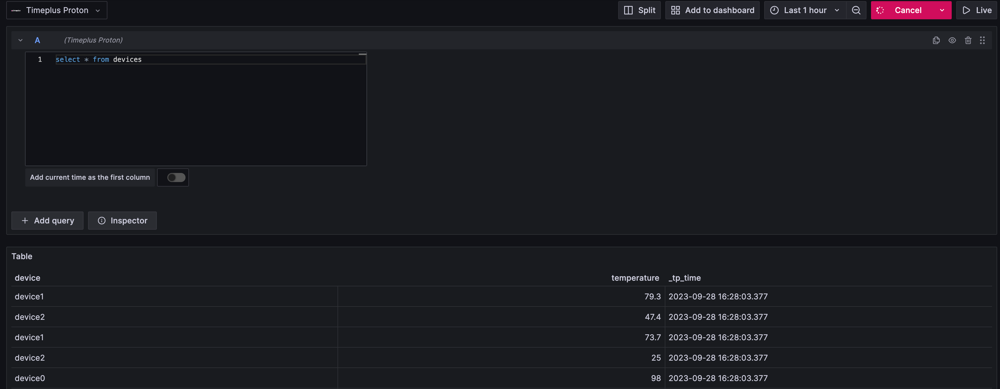

# Proton Grafana Datasource
Grafana data source plugin to connect to Proton and visualize streaming or batch queries.

## Overview / Introduction

[Proton](https://github.com/timeplus-io/proton) is a unified streaming and historical data processing engine in a single binary. It helps data engineers and platform engineers solve complex real-time analytics use cases, and powers the Timeplus streaming analytics platform.

## Requirements

Grafana v10.0.3 or above

https://github.com/timeplus-io/proton

## Getting Started

### Use the pre-built Docker Compose
The [docker-compose.yaml](docker-compose.yaml) in this folder ships a Grafana container, with the proton plugin pre-installed, as well as a data generator.

You start it with `docker compose up` and go to http://localhost:3000 to add a new data source for Proton, using `proton` as the hostname.
Then create a new dashboard by copying the content of [carsharing_grafana_dashboard.json](carsharing_grafana_dashboard.json) in the dashboard JSON model.

### Use your own Grafana deployment

Before the plugin is approved by Grafana, you need to set your Grafana running in development mode via changing /usr/local/etc/grafana/grafana.ini, setting `app_mode = development`

In the navigation menu, choose Connections -> Add new connection.

Search for Proton and accept the default settings (localhost:8463 as proton connection)

Create a new dashboard or explore data with this Proton data source.

There are unbounded streaming query and bounded historical query in proton, all queries like `select * from stream_name` are default to streaming query, and adding `table` function to the stream name will turn the query into bounded query.

By default, the "Streaming Query" toggle is off. If your SQL is a streaming SQL, make sure to turn it on to leverage Grafana's live chart to show the new results.




## Development

### Backend

1. Update [Grafana plugin SDK for Go](https://grafana.com/docs/grafana/latest/developers/plugins/backend/grafana-plugin-sdk-for-go/) dependency to the latest minor version:

   ```bash
   go get -u github.com/grafana/grafana-plugin-sdk-go
   go mod tidy
   ```

2. Build backend plugin binaries for Linux, Windows and Darwin:

   ```bash
   brew install mage
   mage -v
   ```

   mage build:linuxARM will fail, which is okay. Only 64bit OS are supported.

3. List all available Mage targets for additional commands:

   ```bash
   mage -l
   ```
### Frontend

1. Install dependencies

   ```bash
   npm install
   ```

2. Build plugin in development mode and run in watch mode (Ctrl+C to stop)

   ```bash
   npm run dev
   ```

3. Build plugin in production mode

   ```bash
   npm run build
   ```

# Distributing your plugin

When distributing a Grafana plugin either within the community or privately the plugin must be signed so the Grafana application can verify its authenticity. This can be done with the `@grafana/sign-plugin` package.

_Note: It's not necessary to sign a plugin during development. The docker development environment that is scaffolded with `@grafana/create-plugin` caters for running the plugin without a signature._

## Initial steps

Before signing a plugin please read the Grafana [plugin publishing and signing criteria](https://grafana.com/developers/plugin-tools/publish-a-plugin/publishing-and-signing-criteria) documentation carefully.

`@grafana/create-plugin` has added the necessary commands and workflows to make signing and distributing a plugin via the grafana plugins catalog as straightforward as possible.

Before signing a plugin for the first time please consult the Grafana [plugin signature levels](https://grafana.com/docs/grafana/latest/developers/plugins/sign-a-plugin/#plugin-signature-levels) documentation to understand the differences between the types of signature level.

1. Create a [Grafana Cloud account](https://grafana.com/signup).
2. Make sure that the first part of the plugin ID matches the slug of your Grafana Cloud account.
   - _You can find the plugin ID in the `plugin.json` file inside your plugin directory. For example, if your account slug is `acmecorp`, you need to prefix the plugin ID with `acmecorp-`._
3. Create a Grafana Cloud API key with the `PluginPublisher` role.
4. Keep a record of this API key as it will be required for signing a plugin

## Signing a plugin

### Using Github actions release workflow

If the plugin is using the github actions supplied with `@grafana/create-plugin` signing a plugin is included out of the box. The [release workflow](./.github/workflows/release.yml) can prepare everything to make submitting your plugin to Grafana as easy as possible. Before being able to sign the plugin however a secret needs adding to the Github repository.

1. Please navigate to "settings > secrets > actions" within your repo to create secrets.
2. Click "New repository secret"
3. Name the secret "GRAFANA_API_KEY"
4. Paste your Grafana Cloud API key in the Secret field
5. Click "Add secret"

#### Push a version tag

To trigger the workflow we need to push a version tag to github. This can be achieved with the following steps:

1. Run `npm version <major|minor|patch>`
2. Run `git push origin main --follow-tags`


## Learn more

Below you can find source code for existing app plugins and other related documentation.

- [Basic data source plugin example](https://github.com/grafana/grafana-plugin-examples/tree/master/examples/datasource-basic#readme)
- [`plugin.json` documentation](https://grafana.com/developers/plugin-tools/reference-plugin-json)
- [How to sign a plugin?](https://grafana.com/docs/grafana/latest/developers/plugins/sign-a-plugin/)
