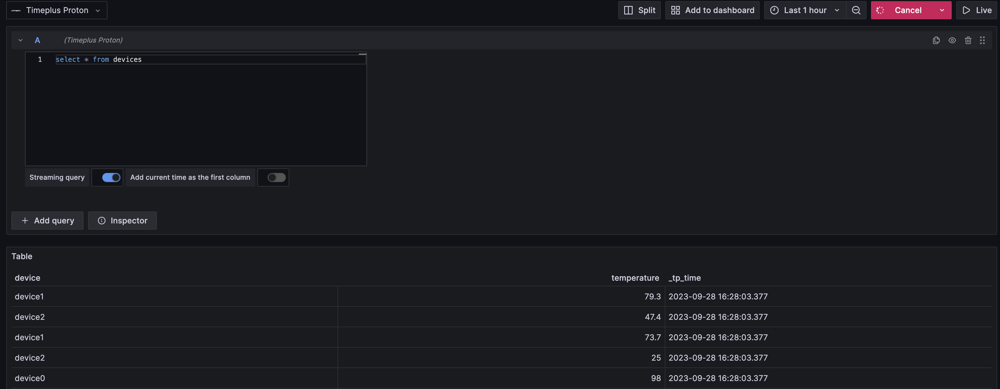

## Overview / Introduction

[Proton](https://github.com/timeplus-io/proton) is a unified streaming and historical data processing engine in a single binary. It helps data engineers and platform engineers solve complex real-time analytics use cases, and powers the Timeplus streaming analytics platform.

## Requirements

## Getting Started

To create a proton data source, 

1. click `add datasource`
2. search `proton`
3. chose `Timeplus Proton`
4. input your proton `host` default to `localhost` and `port` default to `8463`
5. click `Save and test`

Then you should be able to explore this proton data source.

There are unbounded streaming query and bounded historical query in proton, all queries like `select * from stream_name` are default to streaming query, and adding table function to the stream name will turn the query into bounded query.

For streaming query, check the option `Streaming query` in your query editor.

 
## Documentation

## Contributing